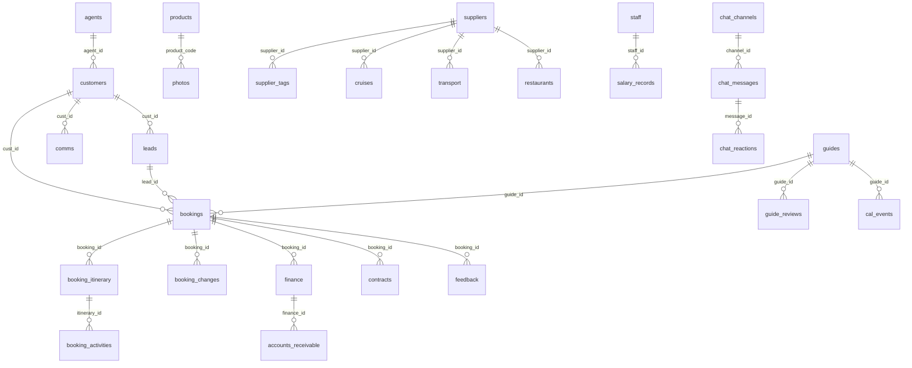

# The Ant Adventures CRM — Database Design (v5.0)

Tài liệu thiết kế CSDL PostgreSQL cho **The Ant Adventures CRM**, dùng trên **Supabase**.  
Schema **quan hệ hoàn toàn** — **không dùng JSONB** làm kho document.

| | |
|---|---|
| **File SQL** | [`supabase/schema.sql`](../supabase/schema.sql) |
| **Kiểm tra số dòng** | [`supabase/verify-counts-v5.sql`](../supabase/verify-counts-v5.sql) |
| **Reset DB** | [`supabase/reset-v5.sql`](../supabase/reset-v5.sql) |
| **Hướng dẫn Supabase** | [`docs/SUPABASE-SETUP.md`](./SUPABASE-SETUP.md) |

---

## 1. Tổng quan kiến trúc

### 1.1 Nguyên tắc thiết kế

1. **Một cột = một thuộc tính nghiệp vụ** — dễ query, index, báo cáo SQL.
2. **Khóa ngoại (FK)** — đảm bảo toàn vẹn: customer ↔ lead ↔ booking ↔ finance.
3. **Bảng con cho dữ liệu lặp** — itinerary từng ngày, activity từng buổi, tag nhiều-nhiều.
4. **ID text có ý nghĩa** — giữ format hiện tại (`CUS-26-001`, `BK-2026-001`, `AGT-001`).
5. **Supabase là nguồn chính** — app đọc/ghi trực tiếp qua `@supabase/supabase-js` (auto-sync).
6. **Seed HTML/local** — chỉ tham khảo ban đầu; không còn là nguồn production.

### 1.2 So sánh v4.3 → v5.0

| v4.3 (cũ) | v5.0 (mới) |
|-----------|------------|
| 23 bảng `{ id, data jsonb }` | 35+ bảng quan hệ |
| Nested JSON trong `data` | Cột typed + bảng con |
| `crm_messages` 1 row JSON | `chat_channels` + `chat_messages` + `chat_reactions` |
| `customers.data.bookings[]` | Quan hệ qua `bookings.cust_id` |
| `bookings.data.itinerary[]` | `booking_itinerary` + `booking_activities` |
| `guides.data.reviews[]` | `guide_reviews` |
| `photos.data.tags[]` | `photo_tags` |
| `suppliers.data.tags[]` | `supplier_tags` |

### 1.3 Sơ đồ quan hệ (ER — rút gọn)



---

## 2. Ánh xạ module CRM ↔ PostgreSQL

| # | Module CRM (trang app) | Bảng chính | Bảng phụ |
|---|------------------------|------------|----------|
| 1 | Customers | `customers` | → `agents` |
| 2 | B2B Agents | `agents` | |
| 3 | Sales Pipeline | `leads` | → `customers` |
| 4 | Bookings | `bookings` | `booking_itinerary`, `booking_activities`, `booking_changes` |
| 5 | Comms (trong Customer profile) | `comms` | |
| 6 | Guides | `guides` | `guide_reviews` |
| 7 | Products / Tour Design | `products` | |
| 8 | Finance | `finance` | |
| 9 | AR / AP | `accounts_receivable`, `accounts_payable` | → `finance`, `bookings` |
| 10 | Tax | `tax_reports` | |
| 11 | HR / Salary | `staff` | `salary_records` |
| 12 | Planner / Tasks | `tasks` | |
| 13 | Contracts | `contracts` | |
| 14 | Post-tour / Feedback | `feedback` | |
| 15 | Suppliers (extended) | `suppliers` | `supplier_tags` |
| 16 | Suppliers tabs | `cruises`, `transport`, `restaurants` | → `suppliers` (optional) |
| 17 | Gallery | `photos` | `photo_tags` |
| 18 | Guide calendar | `cal_events` | |
| 19 | Team Chat | `chat_channels`, `chat_messages`, `chat_reactions` | |
| 20 | Dev Notes | `dev_notes` | |

*Các trang About, Culture, Regulations, Weather, Attractions — nội d dung tĩnh, không cần bảng riêng (hoặc CMS sau).*

---

## 3. Chi tiết bảng & mapping từ app

### 3.1 `agents`

| Cột DB | Kiểu | App field | Ví dụ |
|--------|------|-----------|-------|
| id | text PK | id | AGT-001 |
| name | text | name | ILV |
| commission_pct | numeric | commissionPct | 12 |
| contact_name | text | contactName | Charu |
| tier | text | tier | Silver |

### 3.2 `customers`

| Cột DB | App field | Ghi chú |
|--------|-----------|---------|
| nationality | nat | |
| travel_style | style | Luxury, Cultural… |
| language | lang | |
| client_type | clientType | b2b \| b2c |
| agent_id | agentId | FK → agents |
| ~~bookings[]~~ | bookings | **Bỏ** — dùng `SELECT * FROM bookings WHERE cust_id = ?` |

### 3.3 `leads`

| Cột DB | App field | Ghi chú |
|--------|-----------|---------|
| cust_id | custId | FK |
| follow_up_date | followUpDate | date |
| next_action | nextAction | |
| stage | stage | CHECK 9 giá trị pipeline |

**Stage hợp lệ:** Inquiry, Designing, Quoted, Negotiation, Confirmed, On Tour, Completed, Lost, Pending

### 3.4 `bookings` + itinerary

**`bookings`**

| Cột DB | App field |
|--------|-----------|
| cust_id | custId |
| start_date | start |
| end_date | end |
| guide_name | guide |
| guide_id | *(resolve từ guides nếu match)* |
| guide_alert_pending | guideAlertPending |

**`booking_itinerary`** — 1 row / ngày / booking

| Cột DB | App field |
|--------|-----------|
| day_number | itinerary[].day |
| destination | itinerary[].dest |
| hotel | itinerary[].hotel |

**`booking_activities`** — 1 row / activity

| Cột DB | App field |
|--------|-----------|
| name | activities[].name |
| category | activities[].cat |

**`booking_changes`** — thay cho `bookings.changes[]`

### 3.5 `comms`

| Cột DB | App field |
|--------|-----------|
| cust_id | cid |
| comm_date | date |
| direction | dir |
| subject | subj |

### 3.6 `guides` + `guide_reviews`

| Cột DB | App field |
|--------|-----------|
| full_name | fullname |
| english_name | ename |
| daily_rate | rate |
| years_exp | years |
| shirt_size | shirtSize |
| bank_account | bankAccount |

`guide_reviews` thay cho `guides.reviews[]`.

### 3.7 `products`

PK = **`code`** (không phải `id`).

| Cột DB | App field |
|--------|-----------|
| code | code |
| duration | dur |
| category | cat |
| price_from | price |

### 3.8 Finance module

**`finance`**

| Cột DB | App field |
|--------|-----------|
| booking_id | bkid |
| revenue | rev |
| cash_in | cashIn |
| cash_out | cashOut |
| invoice_ref | inv |

**`accounts_receivable`** (app: `ar`)

| Cột DB | App field |
|--------|-----------|
| finance_id | finId |
| invoice_amount | invoiceAmt |
| deposit_paid | depositPaid |
| due_date | dueDate |

**`accounts_payable`** (app: `ap`) — giữ nguyên tên cột gần với seed.

**`tax_reports`** (app: `tax`)

| Cột DB | App field |
|--------|-----------|
| vat_output | vat_out |
| vat_input | vat_in |
| profit_before_tax | profit_bt *(generated)* |
| vat_payable | vat_pay *(generated)* |

### 3.9 `staff` / `feedback` / `contracts`

Mapping đầy đủ trong SQL comments — xem [`schema.sql`](../supabase/schema.sql).

**Feedback:** `overall` → `overall_rating`, `guide_r` → `guide_rating`, `again` → `would_return`.

**Contracts:** `depositAmt` → `deposit_amount`, `flights` → `flights_info`.

### 3.10 Suppliers

- **`suppliers`** — gom `specialSuppliers` (extended) từ app.
- **`cruises`, `transport`, `restaurants`** — tab nhanh trên UI; có thể link `supplier_id` khi merge dữ liệu.
- **`supplier_tags`** — thay `tags[]`.

### 3.11 Chat

| v4.3 | v5 |
|------|-----|
| `messages.general[]` | `chat_messages` WHERE channel_id = 'general' |
| `message.reactions[]` | `chat_reactions` |
| `message.text` | `body` |
| `message.time` | `sent_at` |

10 kênh seed: general, sales, operations, finance, guides, devnotes, tai, linh, minh, huong.

### 3.12 `photos` + `photo_tags`

| Cột DB | App field |
|--------|-----------|
| product_code | product |
| tags[] | bảng `photo_tags` |

---

## 4. Ràng buộc & chỉ mục

- **FK cascade** trên dữ liệu phụ thuộc (itinerary, comms, tags).
- **RESTRICT** trên `bookings.cust_id`, `contracts.booking_id` — tránh xóa nhầm booking đang có hợp đồng.
- **Generated columns:** `accounts_receivable.balance`, `tax_reports.vat_payable`, `salary_records.net_pay`.
- **Index** theo cột filter thường dùng: stage, status, assignee, due_date, channel_id.
- **RLS:** policy `dev_allow_all` — **chỉ dev**; production cần auth + policy theo role.

---

## 5. Quy trình triển khai trên Supabase

Migration v4.3 JSONB → v5 relational **đã hoàn tất**. Quy trình chuẩn cho project mới hoặc cài lại:

```text
1. Supabase Dashboard → SQL → Run supabase/reset-v5.sql (nếu cần xóa bảng cũ)
2. Run supabase/schema.sql
3. Run supabase/import-v5-data.sql
4. Run supabase/verify-counts-v5.sql — cột rows phải khớp expected
5. .env.local: NEXT_PUBLIC_USE_SUPABASE=true + URL + anon key
```

Chi tiết từng bước: [`docs/SUPABASE-SETUP.md`](./SUPABASE-SETUP.md)

### App layer

- `lib/db/mappers.ts` — map snake_case DB ↔ camelCase app
- `lib/db/supabase.ts` — CRUD v5; booking save tự sync `booking_itinerary` + `booking_activities`
- `photos` / `suppliers` sync kèm `photo_tags` / `supplier_tags`
- `chat_messages` + `chat_reactions` thay `crm_messages` JSONB
- Khi `NEXT_PUBLIC_USE_SUPABASE=true`: store **không persist** localStorage — hydrate từ Supabase

---

## 6. Quy ước đặt tên

| Lớp | Quy ước | Ví dụ |
|-----|---------|-------|
| PostgreSQL | snake_case | `cust_id`, `follow_up_date` |
| TypeScript app (hiện tại) | camelCase | `custId`, `followUpDate` |
| ID prefix | Mã nghiệp vụ | CUS-, BK-, AGT-, FIN-, AR- |

Mapper nên nằm ở `lib/db/mappers/` — một file per entity.

---

## 7. Bảng không có trong seed (sẵn sàng mở rộng)

| Bảng | Mục đích |
|------|----------|
| `booking_changes` | Audit sửa booking |
| `guide_reviews` | Review theo từng tour |
| `salary_records` | Lương tháng (trang Salary) |
| `supplier_tags` | Preferred, UHNW, Seasonal… |

---

## 8. Checklist trước go-live

- [x] Chạy `schema.sql` trên Supabase
- [x] Import dữ liệu (`import-v5-data.sql`)
- [x] `verify-counts-v5.sql` — rows ≈ expected
- [x] App adapter v5 (`lib/db/supabase.ts` + `lib/db/mappers.ts`)
- [ ] Thắt RLS + Supabase Auth
- [ ] Backup schedule (Supabase dashboard)

---

## 9. Tài liệu tham khảo nội bộ

- Types app: `lib/types.ts`
- Seed tham khảo: `lib/seeds/*`
- Supabase setup: [`docs/SUPABASE-SETUP.md`](./SUPABASE-SETUP.md)

---

*Schema v5.0 — The Ant Adventures · CRM PostgreSQL · Supabase*
