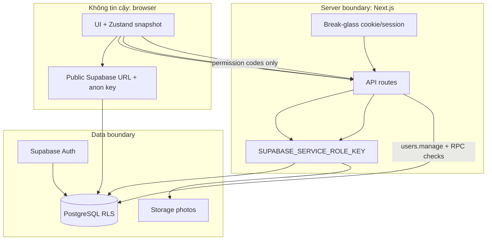
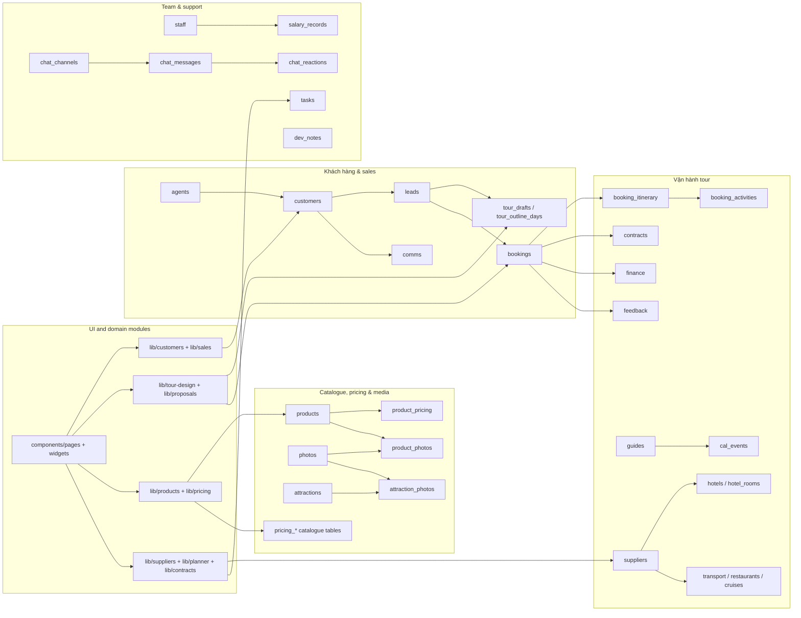
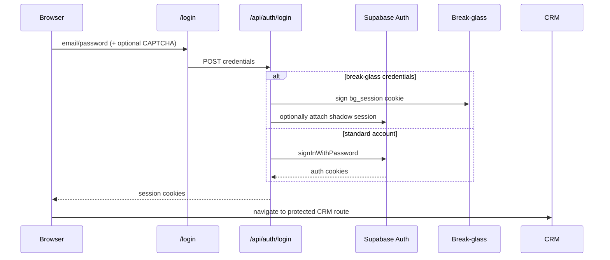
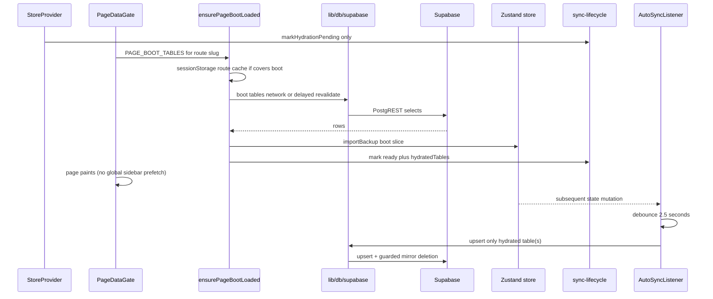
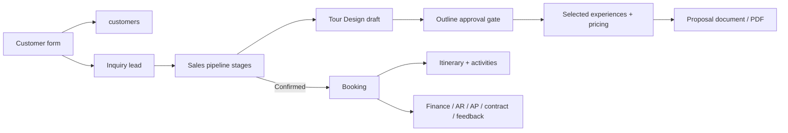
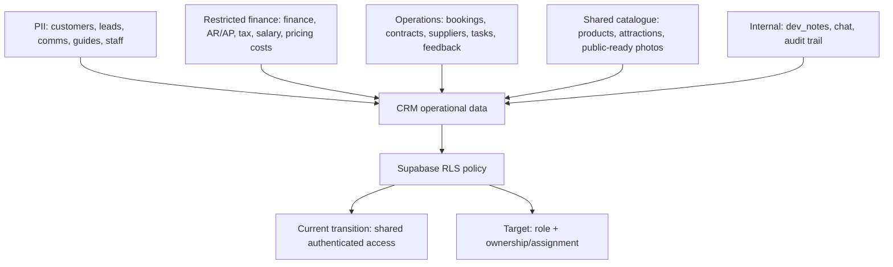
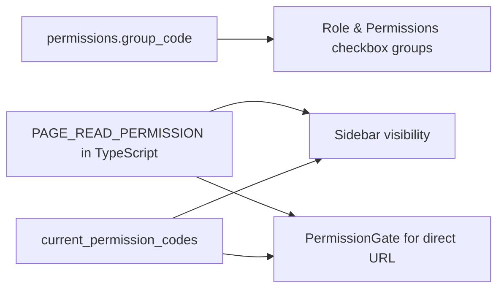
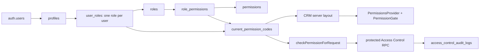

# GraphRAG Memory — The Ant Adventures CRM

> Snapshot: 2026-08-07 · phạm vi: mã nguồn đang có trong repository, không bao gồm `node_modules` hay `.next`. Bao gồm trạng thái Access Control role động, cache SWR, i18n EN/VI và đối chiếu permission-sidebar trên Supabase local.
>
> Mục đích: đây là memory map để truy vết nhanh **chức năng → file → dữ liệu → luồng chạy**. Các sơ đồ là các cạnh có hướng; tên trong dấu backtick là node có thể tìm bằng `rg`.

## 1. Retrieval index

| Muốn tìm | Bắt đầu từ | Theo cạnh tới |
|---|---|---|
| Điều hướng/trang CRM | `lib/constants.ts` (`NAV_SECTIONS`, `VALID_PAGES`) | `app/(crm)/[page]/page.tsx` → `components/pages/index.ts` → page component |
| Dữ liệu CRM | `lib/store.ts`, `lib/types.ts` | `components/StoreProvider.tsx` → `lib/db/hydrate.ts` / `lib/db/sync-push.ts` → `lib/db/supabase.ts` |
| Supabase/schema & RLS | `supabase/schema.sql`, `supabase/migrations/20260730042242_02_migrations.sql`, `docs/DATABASE.md` | table → mapper trong `lib/db/mappers.ts` → `lib/db/supabase.ts`; RLS chuyển tiếp ở `supabase/rls-authenticated.sql` |
| Đăng nhập/session | `app/api/auth/login/route.ts` | `lib/auth/*`, `lib/env.ts`, `proxy.ts` |
| Quyền và Access Control | `lib/auth/permissions.ts` | `app/(crm)/layout.tsx` → `getInitialPermissionCodesForCRMLayout()` → `current_permission_codes()` → `PermissionsProvider`; `/access-control` → `components/access-control/*` → `/api/access-control/*` → RPC Supabase |
| Sales đến booking | `components/pages/Sales.tsx` | `lib/customers/*`, `lib/sales/*`, `components/pages/Bookings.tsx` |
| Thiết kế tour/proposal | `components/pages/TourDesign.tsx` | `components/tour-design/*` → `lib/tour-design/*` / `lib/proposals/*` |
| Bảng giá/XLSX | `components/pages/Pricing*.tsx` | `components/pricing/*` → `lib/pricing/*` → bảng `pricing_*` |
| Ảnh | `components/pages/Gallery.tsx` | `components/gallery/*` → `lib/gallery/*` / `lib/storage/*` → Storage `photos` |
| API server | `app/api/**/route.ts` | `lib/auth`, `lib/weather`, `lib/storage`, `lib/system`, `lib/proposals` |
| Kiểm thử | `tests/*.test.ts` | module `lib/` cùng tên; test runner là `npm test` (hai test XLSX cần workbook gitignored trong `Personal/Material/pricing/`) |

## 2. System graph

```mermaid
flowchart LR
  U[Nhân viên / Browser] --> N[Next.js 16 App Router]
  N --> L[Root layout]
  L --> R[/(crm)/[page] dynamic route]
  R --> C[CRM client shell]
  C --> P[components/pages]
  C --> Z[Zustand: lib/store.ts]
  P --> Z
  C --> S[StoreProvider + AutoSyncListener]
  S --> H[Hydrate: lib/db/hydrate.ts]
  H --> HL[Hydration lifecycle + baseline counts]
  S --> A[Auto-sync: lib/db/auto-sync.ts]
  HL --> A
  H --> D[lib/db/supabase.ts]
  A --> D
  D --> SB[(Supabase PostgreSQL + Storage)]
  N --> API[app/api/* route handlers]
  API --> SB
  API --> EXT[Open-Meteo / Puppeteer PDF]
  P --> AC[Access Control UI]
  AC --> API
  API --> ARBAC[Access Control RPC]
  ARBAC --> SB
  U --> LOGIN[/login]
  LOGIN --> AUTH[/api/auth/login]
  AUTH --> SA[Supabase Auth + break-glass]
```

### Trust boundaries



## 3. Route and UI graph

```mermaid
flowchart TB
  ROOT[/] --> DASH[/dashboard]
  CRM[app/(crm)/layout.tsx] --> SHELL[Sidebar + Topbar + StoreProvider + AI Copilot]
  DYN[app/(crm)/[page]/page.tsx] --> REG[PAGE_COMPONENTS]

  REG --> S1[Sales & Product]
  S1 --> dashboard
  S1 --> planner
  S1 --> customers
  S1 --> agents
  S1 --> sales
  S1 --> tourdesign
  S1 --> products
  S1 --> gallery
  S1 --> pricing
  S1 --> pricing_essentials[pricing-essentials]
  S1 --> pricing_accommodation[pricing-accommodation]
  S1 --> weather
  S1 --> attractions

  REG --> S2[Operations]
  S2 --> bookings
  S2 --> contracts
  S2 --> suppliers
  S2 --> guides
  S2 --> posttour

  REG --> S3[Finance]
  S3 --> finance
  S3 --> tax
  S3 --> salary

  REG --> S4[Company Portal]
  S4 --> about
  S4 --> culture
  S4 --> regulations
  S4 --> hr
  S4 --> ai
  S4 --> devnotes
  S4 --> teamchat

  REG --> S5[System]
  S5 --> accesscontrol[access-control]
```

Page registry: `components/pages/index.ts` lazy-loads every page except `Dashboard`. `lib/constants.ts` is the authoritative navigation and slug registry; `lib/types.ts` supplies `PageSlug`.

## 4. Domain graph



### Domain node catalogue

| Area | UI nodes | Logic/data nodes | Primary persistence |
|---|---|---|---|
| CRM shell | `Sidebar`, `Topbar`, `StoreProvider`, `AutoSyncListener` | `store.ts`, `constants.ts`, `types.ts`, `context/` | all synchronised tables |
| Customers & B2B | `pages/Customers`, `pages/Agents`, `components/customers`, `components/agents` | `customers/`, `sales/agents-commission.ts` | `customers`, `agents`, `comms`, `leads` |
| Sales | `pages/Sales` | `sales/sales-lead-utils.ts`, `sales/booking-from-lead.ts` | `leads`, `bookings` |
| Tour Design | `pages/TourDesign`, `components/tour-design/*` | `tour-design/*`, `proposals/*` | `tour_drafts`, `tour_outline_days`, products/pricing |
| Product & Gallery | `pages/Products`, `pages/Gallery`, `components/products`, `components/gallery` | `products/*`, `gallery/*`, `storage/*` | `products`, `product_pricing`, `photos`, Storage |
| Pricing | `pages/Pricing*`, `components/pricing/*` | `pricing/*` | `pricing_*` tables; selected legacy product prices |
| Operations | `pages/Bookings`, `Contracts`, `Suppliers`, `Guides`, `PostTour`, `Planner` | `contracts/`, `suppliers/`, `planner/` | booking, supplier, guide, contract, feedback, task tables |
| Finance & HR | `pages/Finance`, `Tax`, `Salary`, `HR` | shared store/mappers | finance, AR/AP, tax, staff, salary tables |
| Information | `About`, `Culture`, `Regulations`, `AI`, `DevNotes`, `TeamChat`, `Weather`, `Attractions` | `weather/*`, `attractions/*`, `system/*`, `i18n/*` | notes/chat/weather cache/attractions |

## 5. Execution-flow graph

### Login and session



Implemented session bridge: [`proxy.ts`](proxy.ts) calls `updateSession` from `lib/supabase/middleware.ts`; `lib/supabase/index.ts` caches the browser client created by `lib/supabase/client.ts`. Proxy keeps `/api/health`, login/logout and configured debug paths public, refreshes Supabase cookies, and redirects unauthenticated CRM traffic to `/login`. Break-glass sessions can also attach a shadow Supabase session for authenticated RLS access.

### Permission load and Access Control

```mermaid
sequenceDiagram
  participant B as Browser
  participant L as CRM server layout
  participant PP as PermissionsProvider
  participant RPC as current_permission_codes()
  participant AC as /access-control + API
  participant DB as Access Control RPC

  B->>L: navigate to protected CRM route with session cookie
  L->>RPC: getInitialPermissionCodesForCRMLayout()
  RPC-->>L: permission codes, e.g. users.manage or *
  L-->>PP: initialPermissionCodes prop
  PP->>AC: PermissionGate checks PAGE_READ_PERMISSION
  alt Has users.manage or *
    AC->>DB: manage users/roles/audit through protected API
  else Missing permission
    AC-->>B: do not mount page; link back to Dashboard
  end
```

`PermissionsProvider` initializes a React `Set` from server data, so Sidebar and `PermissionGate` do not wait for a browser permission request after login. `hasPermission()` accepts either the requested code or wildcard `*`; both `admin` and `super_admin` currently have that wildcard. `loadPermissions()` still exists only for an explicit retry/refresh.

This Context is memory for the current React tree, not a persistent cache. Every Access Control API and its database RPC perform their own `users.manage` check.

### Hydrate and synchronization



Important implementation nodes:

- `lib/db/sync-config.ts` maps 28 table names to `BackupData`/Zustand keys, declares `PAGE_BOOT_TABLES` (per-route boot), `PROFILE_LAZY_TABLES`, and FK-safe write waves. Sidebar Planner / Tour Design badges use already-hydrated store data (no idle global fetch).
- `lib/db/route-cache.ts` — sessionStorage route snapshot (5 min TTL); background revalidate only after 60s or on tab visible.
- `lib/db/mappers.ts` transforms domain models ↔ SQL rows.- `lib/db/sync-lifecycle.ts` tracks `hydratedTables` / messages; blocks automatic writes until boot ready; auto-sync must not push unhydrated tables.
- `lib/db/sync-policy.ts` makes `products` and `product_pricing` upsert-only. Other synchronized tables skip orphan deletion when the local row count is below 90% of the hydrated baseline; `force` can bypass that guard for mirror tables.
- `lib/db/supabase.ts` reads nested associations via PostgREST embeds (one request per parent table) and can delete remote IDs absent from a local snapshot when the guard permits it. Nested booking, hotel, product and attraction associations are replaced per parent during sync.
- `components/PageDataGate.tsx` boots route tables; `CustomerProfileModal` lazy-loads `comms` + `bookings`.

### Sales to proposal to booking



### Photo and weather server paths

```mermaid
flowchart LR
  G[Gallery UI] --> Init[/api/photos/upload/init]
  Init --> Chunk[/api/photos/upload/chunk]
  Chunk --> Complete[/api/photos/upload/complete]
  Complete --> Pipe[lib/image-pipeline + upload-gallery-photo-server]
  G --> PD[/api/photos/delete]
  PD --> Pipe
  Pipe --> ST[Supabase Storage photos bucket]
  Pipe --> PT[photos + photo_tags]

  W[Weather UI] --> WR[/api/weather/refresh]
  WR --> WA[lib/weather/auth]
  WA --> OF[Open-Meteo]
  OF --> WC[weather_* cache tables]
  W --> WW[/api/weather/weekly]
  WW --> WC
```

## 6. API graph and guards in the current source

| Route | Consumer / purpose | Current guard | Dependency |
|---|---|---|---|
| `POST /api/auth/login` | login form | rate limit; public by design | Supabase Auth / break-glass |
| `POST /api/auth/logout` | Topbar | no explicit route check | Supabase Auth |
| `GET,POST /api/auth/users` | recovery/admin use | `requireBreakGlass` | service-role Auth admin |
| `GET /api/health` | external monitor | public by design | Supabase Auth health |
| `POST /api/photos/upload/init`, `/chunk`, `/complete`, `/delete` | gallery (chunked → Sharp → Storage) | authenticated only | Storage + `photos` tables |
| `POST /api/pricing/export`, `/api/proposals/export` | pricing/tour-design | authenticated only; no role/permission export check | Puppeteer/Chromium PDF |
| `GET,PUT /api/proposals/templates` | Tour Design Step 5 Edit Template | authenticated only | `proposal_templates` (lazy; not page-boot) |
| `GET,PUT /api/system/*` | debug panel | debug token except debug-log POST | diagnostics/log buffer |
| `POST /api/weather/refresh` | weather page or cron | authenticated user or cron secret | service-role cache + Open-Meteo |
| `GET /api/weather/weekly` | weather page | no explicit guard | service-role cache |
| `GET,PATCH /api/access-control` | role/permission metadata and assign a role to a user | `users.manage` at API and RPC | `list_access_control_roles`, `list_access_control_permissions`, `set_user_role`; legacy employee-permission PATCH remains but current UI does not call it |
| `GET,POST,PATCH /api/access-control/users` | paged user directory and account create/edit/status | `users.manage` at API and RPC; create additionally uses server-only Admin API | Auth, `profiles`, `user_roles`, audit RPC |
| `GET,POST,PATCH /api/access-control/staff-roles` | dynamic staff roles and their permissions | `users.manage` at API and RPC | dynamic role create/update/permission RPCs |
| `GET /api/access-control/audit-logs` | audit log tab | `users.manage` at API and RPC | paginated audit-log RPC |

## 7. Data graph and sensitivity groups



Schema relationships live in `docs/DATABASE.md` and `supabase/schema.sql`; the CLI baseline is `supabase/migrations/20260730042242_02_migrations.sql`. Fresh schema/migration sources still create `dev_allow_all` policies. The tracked `supabase/rls-authenticated.sql` is a manual transition run after Auth login works: it replaces those policies with shared `authenticated_access` policies. It blocks anonymous direct access but does **not** implement the role/ownership model below; whether it has been applied to a remote project must be checked separately.

## 8. RBAC implementation — verified 2026-08-05

### Current role model

RBAC uses permission codes as the enforcement primitive. A user has one role; a role has many permission codes. Application code checks a permission such as `sales.write`, not a business role name such as `sale`.

| Role type | Database state | Access Control behavior |
|---|---|---|
| `super_admin` | system role, wildcard `*` | Technical full-access role. It is excluded from the paged user list, staff-role list, filters and assignment UI. Historical audit values may still render its label. |
| `admin` | system role, wildcard `*` | Full business access, including `users.manage`. It is not editable through role-permission checkboxes. |
| `employee`, `sale`, `hr`, future roles | non-system roles in `roles` | Normal staff roles. Their permission list is editable once and shared by all users assigned to that role. Inactive roles remain visible for old assignments but cannot be assigned to new users. |

`users.manage` is the sole permission required to open and operate Access Control. In the current local data, Admin and Super Admin obtain it through wildcard `*`.

### Current sidebar-to-permission binding

The current system has **two separate mappings**. They are consistent for the existing menu, but they are not automatically linked by a database foreign key:

1. `public.permissions.group_code` groups checkboxes in **Role & Permissions**. `permission_groups` supplies the group label/order. For example, `catalogue.read` is displayed in the `catalogue` group.
2. `lib/auth/permissions.ts` owns `PAGE_READ_PERMISSION`, a handwritten `PageSlug -> permission code` map. `Sidebar` and `PermissionGate` use this map to decide whether a user can see/open a page.



Current page bindings are:

| Sidebar feature(s) | Required page-read permission | Current granularity |
|---|---|---|
| Dashboard | `dashboard.read` | one feature |
| Daily Planner + Sales Pipeline | `sales.read` | grouped |
| Clients | `customers.read` | one feature |
| B2B Agents | `agents.read` | one feature |
| Tour Design | `tour_design.read` | one feature |
| Tour Products + Photo Gallery + Attraction Schedule | `catalogue.read` | grouped |
| Pricing, Essentials + Accommodation & Cruises | `pricing.read` | grouped |
| Weather Guide | `weather.read` | one feature |
| Bookings + Contracts + Suppliers + Guides + Post-tour | `operations.read` | grouped |
| Finance + Tax | `finance.read` | grouped |
| Salary + Human Resources | `hr.read` | grouped |
| About + Culture + Regulations | `company.read` | grouped |
| AI Requirements + Dev Notes | `devnotes.read` | grouped |
| Team Chat | `teamchat.read` | one feature |
| Access Control | `users.manage` | system-management exception |

`*.write` codes do not decide sidebar visibility. The sidebar/page gate checks only `*.read`; a write code has effect only where that feature's UI action and server API/RPC explicitly check it. At the snapshot date, general CRM CRUD is not yet uniformly protected by feature-level `*.write` checks.

### Agreed RBAC target — one sidebar feature, `read` + `write`

The agreed direction is to make each navigable sidebar leaf a feature. Each feature will own exactly two ordinary business permissions:

```text
<feature>.read  = user can see the menu and open the page
<feature>.write = user can create/update/delete within that feature
```

Examples: `bookings.read` + `bookings.write`, `contracts.read` + `contracts.write`, `gallery.read` + `gallery.write`. Pricing subpages will be separate features (`pricing`, `pricing_essentials`, `pricing_accommodation`) rather than one broad Pricing permission. The wildcard `*` remains for Admin/Super Admin. Access Control will keep stricter API/RPC protections during transition; `users.manage` must not be removed until its protected routes and database RPCs have been migrated and tested.

Implementation plan, not yet applied:

1. Add `page_slug` and `is_navigation_feature` to `permission_groups`; seed one group per sidebar leaf.
2. Seed each navigation group with its `read` and `write` permission, then grant equivalent new permissions to existing roles before changing page checks, so no user loses access during migration.
3. Replace grouped entries such as `catalogue.*` and `operations.*` in `PAGE_READ_PERMISSION` with per-feature codes; expose `readPermissionForPage()` and `writePermissionForPage()` helpers for Sidebar, `PermissionGate` and feature actions.
4. Make Role & Permissions show each sidebar feature as a two-checkbox card. Stop normal UI creation of arbitrary permission groups that have no menu/function mapping.
5. Add UI and API/RPC checks for every feature write command, then retire legacy `*.export`, `*.refresh` and grouped permission codes only after compatibility verification.

### Permission data and enforcement graph



The permission is checked in three places:

1. **UI:** `PermissionGate` maps `/access-control` to `users.manage`, preventing the page component from mounting for users without it.
2. **Next.js API:** every Access Control route checks `checkPermissionForRequest('users.manage')` before reading or writing.
3. **Database RPC:** the sensitive RPC verifies `public.has_permission('users.manage')` again.

The UI layer is for navigation and experience. API and RPC checks are the authorization boundaries for this module.

### Access Control load and SWR cache

`app/(crm)/layout.tsx` gets the initial permission codes on the server and passes them to `PermissionsProvider`. It avoids the older browser-first `/api/auth/permissions` request during normal CRM entry.

The Access Control UI uses the default SWR cache in the JavaScript memory of the current browser tab. There is no custom `SWRConfig`, Redis cache, cookie or localStorage store for role/permission data. Browser reload, closing the tab or logout clears this cache. API responses intentionally use `Cache-Control: no-store`; SWR handles short-lived deduplication.

| SWR key | Data | Important options |
|---|---|---|
| `access-control/roles-permissions` | base roles plus permission catalogue | 60-second deduplication; no revalidation on focus |
| `access-control/staff-roles` | Employee, Sale, HR and future staff roles | 60-second deduplication; shared by User Directory and Role & quyền |
| `['access-control/users', keyword, role, status, page, pageSize]` | one filtered, paged user list | 15-second deduplication; keeps previous table while the next result loads |
| `['access-control/audit-logs', page, pageSize]` | one audit-log page | 30-second deduplication; created only after the Audit tab is first opened |

After successful user or role writes, the relevant SWR `mutate()` reloads its displayed data. `useRefreshAccessControlAuditLogs()` revalidates only audit-log pages already present in SWR cache; it does not reload the entire CRM or create an audit request before the tab has been opened.

### Access Control UI, API and response contracts

| Feature | Main UI node | Request | Response / database operation |
|---|---|---|---|
| Load permission catalogue | `AccessControlPage.tsx` | `GET /api/access-control` | `{ ok, roles, permissions }`; `list_access_control_roles`, `list_access_control_permissions` |
| List dynamic staff roles | `RolesPermissionsTab.tsx`, `UserDirectory.tsx` | `GET /api/access-control/staff-roles` | `{ ok, roles }`; each role has code, label, active state, permission codes and assigned-user count |
| View/filter paged users | `UserDirectory.tsx` | `GET /api/access-control/users?page=&pageSize=&q=&role=&status=` | `{ ok, items, totalCount, page, pageSize, totalPages }`; no user-summary RPC is called by the current UI |
| Create user | `UserCreateDrawer.tsx` | `POST /api/access-control/users` | Service-role creates `auth.users`; trigger creates `profiles`; RPC updates name and sets initial role; partial failure rolls back the new Auth user |
| Change a user role | `UserAccessDrawer.tsx` | `PATCH /api/access-control` with `set_user_role` | `set_user_role`; updates `user_roles` and writes `user_role_changed` audit |
| Edit name / activate / deactivate | `UserEditDrawer.tsx`, `UserActionsMenu.tsx` | `PATCH /api/access-control/users` | profile and lifecycle RPCs, with audit actions |
| Create/edit/deactivate staff role | `StaffRoleCreateDrawer.tsx`, `StaffRoleEditDrawer.tsx` | `POST` / `PATCH /api/access-control/staff-roles` | dynamic role RPCs write `roles` and audit `staff_role_created` or `staff_role_updated` |
| Save role checkboxes | `RolesPermissionsTab.tsx` | `PATCH /api/access-control/staff-roles` with `replace_role_permissions` | `replace_access_control_staff_role_permissions`; replaces rows in `role_permissions` and writes `staff_role_permissions_replaced` |
| Read history | `AuditLogsTab.tsx` | `GET /api/access-control/audit-logs?page=&pageSize=` | protected `list_access_control_audit_logs` with before/after JSON |

The browser calls only `components/access-control/access-control-api.ts`; it does not call Supabase directly for management operations. `lib/access-control/server.ts` builds a Supabase client with the current user's cookies, so PostgreSQL receives the correct `auth.uid()`. The only service-role module is `lib/auth/access-control-admin.ts`, used solely for creating and rolling back a new Auth user.

When a user creates a new account, the audit trail is currently produced by `user_profile_updated` and `user_role_changed`; there is no distinct `user_created` action yet.

### Versioned migrations for the current module

| Migration | Responsibility |
|---|---|
| `20260730074120_rbac_foundation.sql` | Creates initial RBAC tables, `current_permission_codes()` and the Auth-user → profile trigger. |
| `20260802014552_add_access_control_rpcs.sql` | Adds Access Control RPC baseline, audit table and one-role-per-user model. |
| `20260802131905_add_access_control_audit_list.sql` | Adds protected, paged audit-log read RPC. |
| `20260802142349_add_access_control_user_write_rpcs.sql` | Adds profile/status lifecycle RPCs and audit actions. |
| `20260804031112_make_admin_full_access_keep_super.sql` | Makes Admin a full-access system role alongside Super Admin. |
| `20260804033108_hide_super_admin_from_access_control.sql` | Excludes Super Admin from normal Access Control user-management UI/data. |
| `20260804050915_*`, `20260804052028_*`, `20260804052335_*` | Historical job-position model migrations. They remain in history only. |
| `20260804064249_make_employee_roles_dynamic.sql` | Adds dynamic staff-role RPCs and audit actions. |
| `20260804131007_make_employee_a_manageable_staff_role.sql` | Makes Employee a normal manageable staff role. |
| `20260804133056_support_dynamic_roles_in_user_directory.sql` | Supports dynamic role labels, filters and assignments in the user directory. |
| `20260804154323_retire_legacy_job_positions.sql` | Removes the empty job-position tables/RPCs and ensures effective permissions only derive from user role permissions. |

### Audit trail

`access_control_audit_logs` stores actor, optional target user, before value, after value and time. The UI maps database actions to Vietnamese labels. Current actions include `user_role_changed`, `user_profile_updated`, `user_activated`, `user_deactivated`, `user_soft_deleted`, `user_restored`, `staff_role_created`, `staff_role_updated` and `staff_role_permissions_replaced`.

### Deliberately not yet enforced by this module

- General CRM business tables do **not** yet have role/row-scoped RLS based on these permission codes. This module protects Access Control and page-level navigation already wired to `PAGE_READ_PERMISSION`.
- Employee and Admin can both continue using permitted CRM operations such as PDF export according to existing module guards; this module does not broadly lock write actions for Employee.
- The old `PATCH /api/access-control` branch `replace_role_permissions` and its database RPC remain for compatibility, but the current UI saves staff-role permissions through `/api/access-control/staff-roles`. Remove the legacy branch only after confirming no external consumer uses it.

### Future extension direction

Create a shared staff role first, then assign feature-level `read`/`write` permissions to it. Add a new permission pair only when a new sidebar feature is introduced; add it through a migration plus the navigation map, not only through the Access Control UI. For record-specific scope, add ownership/assignment fields and enforce them with RLS after replacing full-table mirror synchronization with record-level server commands.

## 9. Known integrity and delivery constraints

| Priority | Evidence node | Why it matters to the graph/RBAC plan |
|---|---|---|
| Critical | `supabase/schema.sql:1068-1095` and `supabase/migrations/20260730042242_02_migrations.sql` | Both fresh-install sources grant anonymous `dev_allow_all` access. `rls-authenticated.sql` is tracked but is a manual, shared-access transition, so its remote application must be verified. This is separate from the protected Access Control RPCs. |
| High | `supabase/rls-authenticated.sql`, Access Control migrations | Current RBAC protects permission loading and the Access Control module, not CRUD rows in general CRM business tables. Do not represent the current work as complete data-level RBAC. |
| High | `lib/db/supabase.ts`, `lib/db/sync-policy.ts`, `lib/db/sync-lifecycle.ts` | Snapshot mirror sync still deletes remote rows when the 90% baseline guard permits it or an operator forces a push; this conflicts with concurrent editing and future row-scoped RLS. |
| High | `app/api/photos/delete/route.ts` → `lib/storage/upload-gallery-photo-server.ts` → `lib/storage/photo-paths.ts` | Any authenticated user can invoke a service-role-capable delete and provide an additional `storagePath`; folder policy and validation are not a per-record authorization check. |
| Medium | `components/access-control/UserDirectory.tsx` + lifecycle RPCs | Soft-deleted users are excluded from the normal list; an administrator cannot restore one from the UI until a deleted-user view is added. |
| Medium | `.gitlab-ci.yml` | CI runs lint and production build, but not typecheck or tests. |
| Medium | `tests/pricing-catalog-xlsx.test.ts:8-9` | Two tests depend on XLSX files below gitignored `Personal/Material/pricing/`, so a checkout without local material reports two `ENOENT` failures. |
| Medium | `components/pages/Sales.tsx` (882 lines), `TourDesign.tsx` (778), `Bookings.tsx` (694), `Dashboard.tsx` (690), `lib/db/supabase.ts` (821), `lib/proposals/proposal-assembler.ts` (943) | High coupling makes permission checks and future ownership enforcement expensive; extract command/data boundaries before broad RBAC UI work. |

## 10. Verification status

- Static source/database review: refreshed for Access Control routes, UI, server services, SWR cache keys, structured API errors, EN/VI labels, migrations and local database state on 2026-08-07.
- `npx supabase migration list --local`: local and remote histories matched through `20260804154323_retire_legacy_job_positions`; use this command after local migration changes rather than `db:status`, which requires a linked hosted Supabase project.
- `npm run typecheck` and `npm run lint`: passed on 2026-08-05.
- `npm test`: 275 of 277 tests passed in the latest full run. The two failures are `ENOENT` reads for the ignored Essentials and Accommodation XLSX workbooks; no test assertion failed.
- A production build is not claimed for this snapshot: running `next build` concurrently with `next dev` corrupted generated `.next` vendor chunks locally. The cache was moved aside and `next dev` restarted successfully; stop the dev server before the next production-build verification.
- This documentation update changes `docs/GRAPHRAG-MEMORY.md`; no application logic, configuration or database schema was changed by the documentation refresh itself.
