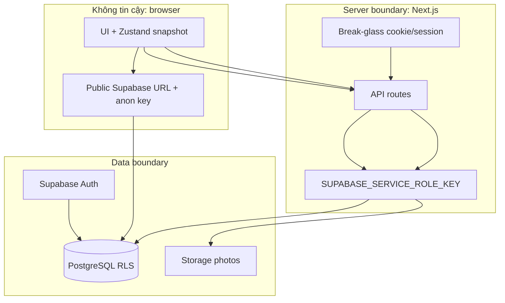
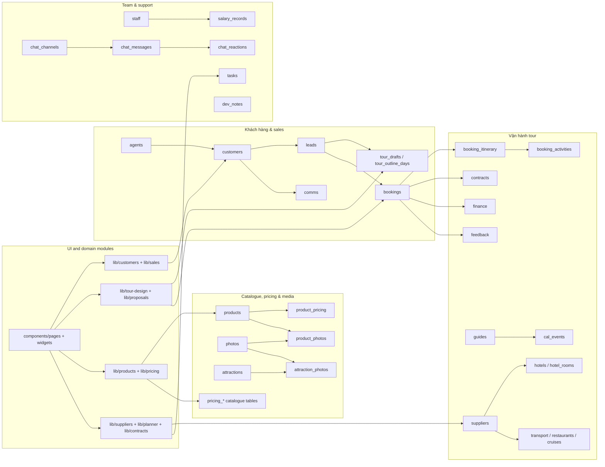
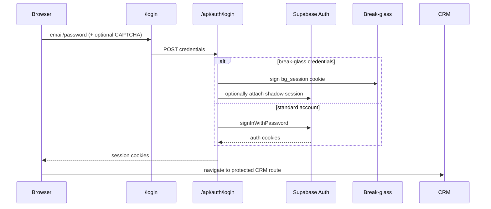
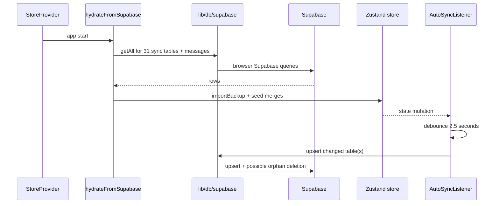
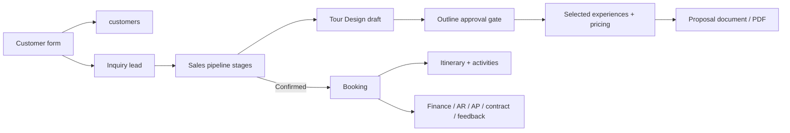
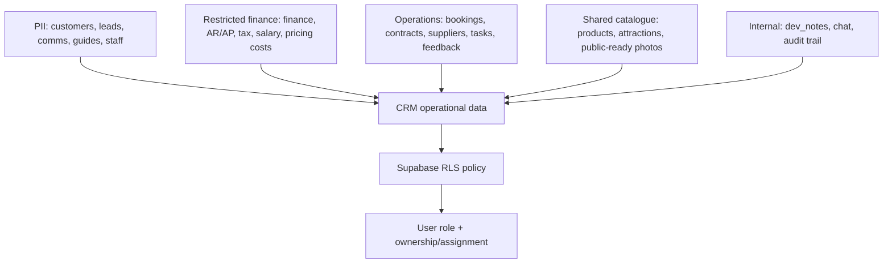
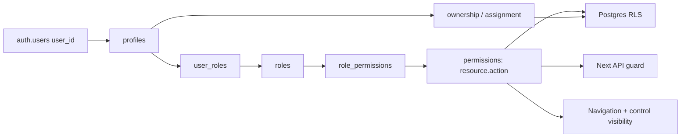

# GraphRAG Memory — The Ant Adventures CRM

> Snapshot: 2026-07-30 · phạm vi: mã nguồn đang có trong repository, không bao gồm `node_modules` hay `.next`.
>
> Mục đích: đây là memory map để truy vết nhanh **chức năng → file → dữ liệu → luồng chạy**. Các sơ đồ là các cạnh có hướng; tên trong dấu backtick là node có thể tìm bằng `rg`.

## 1. Retrieval index

| Muốn tìm | Bắt đầu từ | Theo cạnh tới |
|---|---|---|
| Điều hướng/trang CRM | `lib/constants.ts` (`NAV_SECTIONS`, `VALID_PAGES`) | `app/(crm)/[page]/page.tsx` → `components/pages/index.ts` → page component |
| Dữ liệu CRM | `lib/store.ts`, `lib/types.ts` | `components/StoreProvider.tsx` → `lib/db/hydrate.ts` / `lib/db/sync-push.ts` → `lib/db/supabase.ts` |
| Supabase/schema | `supabase/schema.sql`, `docs/DATABASE.md` | table → mapper trong `lib/db/mappers.ts` → `lib/db/supabase.ts` |
| Đăng nhập/session | `app/api/auth/login/route.ts` | `lib/auth/*`, `lib/env.ts`, `middleware.ts` |
| Sales đến booking | `components/pages/Sales.tsx` | `lib/customers/*`, `lib/sales/*`, `components/pages/Bookings.tsx` |
| Thiết kế tour/proposal | `components/pages/TourDesign.tsx` | `components/tour-design/*` → `lib/tour-design/*` / `lib/proposals/*` |
| Bảng giá/XLSX | `components/pages/Pricing*.tsx` | `components/pricing/*` → `lib/pricing/*` → bảng `pricing_*` |
| Ảnh | `components/pages/Gallery.tsx` | `components/gallery/*` → `lib/gallery/*` / `lib/storage/*` → Storage `photos` |
| API server | `app/api/**/route.ts` | `lib/auth`, `lib/weather`, `lib/storage`, `lib/system`, `lib/proposals` |
| Kiểm thử | `tests/*.test.ts` | module `lib/` cùng tên; test runner là `npm test` |

## 2. System graph

```mermaid
flowchart LR
  U[Nhân viên / Browser] --> N[Next.js 14 App Router]
  N --> L[Root layout]
  L --> R[/(crm)/[page] dynamic route]
  R --> C[CRM client shell]
  C --> P[components/pages]
  C --> Z[Zustand: lib/store.ts]
  P --> Z
  C --> S[StoreProvider + AutoSyncListener]
  S --> H[Hydrate: lib/db/hydrate.ts]
  S --> A[Auto-sync: lib/db/auto-sync.ts]
  H --> D[lib/db/supabase.ts]
  A --> D
  D --> SB[(Supabase PostgreSQL + Storage)]
  N --> API[app/api/* route handlers]
  API --> SB
  API --> EXT[Open-Meteo / Puppeteer PDF / Sentry]
  U --> LOGIN[/login]
  LOGIN --> AUTH[/api/auth/login]
  AUTH --> SA[Supabase Auth + break-glass]
```

### Trust boundaries



## 3. Route and UI graph

```mermaid
flowchart TB
  ROOT[/] --> DASH[/dashboard]
  CRM[app/(crm)/layout.tsx] --> SHELL[Sidebar + Topbar + StoreProvider + AI Copilot]
  DYN[app/(crm)/[page]/page.tsx] --> REG[PAGE_COMPONENTS]

  REG --> S1[Sales & Product]
  S1 --> dashboard
  S1 --> planner
  S1 --> customers
  S1 --> agents
  S1 --> sales
  S1 --> tourdesign
  S1 --> products
  S1 --> gallery
  S1 --> pricing
  S1 --> pricing_essentials[pricing-essentials]
  S1 --> pricing_accommodation[pricing-accommodation]
  S1 --> weather
  S1 --> attractions

  REG --> S2[Operations]
  S2 --> bookings
  S2 --> contracts
  S2 --> suppliers
  S2 --> guides
  S2 --> posttour

  REG --> S3[Finance]
  S3 --> finance
  S3 --> tax
  S3 --> salary

  REG --> S4[Company Portal]
  S4 --> about
  S4 --> culture
  S4 --> regulations
  S4 --> hr
  S4 --> ai
  S4 --> devnotes
  S4 --> teamchat
```

Page registry: `components/pages/index.ts` lazy-loads every page except `Dashboard`. `lib/constants.ts` is the authoritative navigation and slug registry; `lib/types.ts` supplies `PageSlug`.

## 4. Domain graph



### Domain node catalogue

| Area | UI nodes | Logic/data nodes | Primary persistence |
|---|---|---|---|
| CRM shell | `Sidebar`, `Topbar`, `StoreProvider`, `AutoSyncListener` | `store.ts`, `constants.ts`, `types.ts`, `context/` | all synchronised tables |
| Customers & B2B | `pages/Customers`, `pages/Agents`, `components/customers`, `components/agents` | `customers/`, `sales/agents-commission.ts` | `customers`, `agents`, `comms`, `leads` |
| Sales | `pages/Sales` | `sales/sales-lead-utils.ts`, `sales/booking-from-lead.ts` | `leads`, `bookings` |
| Tour Design | `pages/TourDesign`, `components/tour-design/*` | `tour-design/*`, `proposals/*` | `tour_drafts`, `tour_outline_days`, products/pricing |
| Product & Gallery | `pages/Products`, `pages/Gallery`, `components/products`, `components/gallery` | `products/*`, `gallery/*`, `storage/*` | `products`, `product_pricing`, `photos`, Storage |
| Pricing | `pages/Pricing*`, `components/pricing/*` | `pricing/*` | `pricing_*` tables; selected legacy product prices |
| Operations | `pages/Bookings`, `Contracts`, `Suppliers`, `Guides`, `PostTour`, `Planner` | `contracts/`, `suppliers/`, `planner/` | booking, supplier, guide, contract, feedback, task tables |
| Finance & HR | `pages/Finance`, `Tax`, `Salary`, `HR` | shared store/mappers | finance, AR/AP, tax, staff, salary tables |
| Information | `About`, `Culture`, `Regulations`, `AI`, `DevNotes`, `TeamChat`, `Weather`, `Attractions` | `weather/*`, `attractions/*`, `system/*`, `i18n/*` | notes/chat/weather cache/attractions |

## 5. Execution-flow graph

### Login and session



Current coupling: `middleware.ts` imports `lib/supabase/middleware`, and `lib/supabase/index.ts` imports `lib/supabase/client`; neither source file exists in this snapshot. The intended route/session bridge is therefore a critical broken node, not a completed authorization boundary.

### Hydrate and synchronization



Important implementation nodes:

- `lib/db/sync-config.ts` maps 31 table names to `BackupData`/Zustand keys and declares FK-safe write waves.
- `lib/db/mappers.ts` transforms domain models ↔ SQL rows.
- `lib/db/sync-policy.ts` makes `products` and `product_pricing` upsert-only; other synchronized tables are guarded mirrors.
- `lib/db/supabase.ts` still reads and writes many full tables (`select('*')`) and deletes remote IDs absent from the local snapshot.

### Sales to proposal to booking



### Photo and weather server paths

```mermaid
flowchart LR
  G[Gallery UI] --> PU[/api/photos/upload]
  G --> PD[/api/photos/delete]
  PU --> PS[lib/storage/upload-gallery-photo-server]
  PD --> PS
  PS --> ST[Supabase Storage photos bucket]
  PS --> PT[photos + photo_tags]

  W[Weather UI] --> WR[/api/weather/refresh]
  WR --> WA[lib/weather/auth]
  WA --> OF[Open-Meteo]
  OF --> WC[weather_* cache tables]
  W --> WW[/api/weather/weekly]
  WW --> WC
```

## 6. API graph and guards in the current source

| Route | Consumer / purpose | Current guard | Dependency |
|---|---|---|---|
| `POST /api/auth/login` | login form | rate limit; public by design | Supabase Auth / break-glass |
| `POST /api/auth/logout` | Topbar | no explicit route check | Supabase Auth |
| `GET,POST /api/auth/users` | recovery/admin use | `requireBreakGlass` | service-role Auth admin |
| `GET /api/health` | external monitor | public by design | Supabase Auth health |
| `POST /api/photos/upload`, `/delete` | gallery | authenticated only | Storage + `photos` tables |
| `POST /api/pricing/export`, `/api/proposals/export` | pricing/tour-design | authenticated only via `proposal-auth` | Puppeteer/Chromium PDF |
| `GET,PUT /api/system/*` | debug panel | debug token except debug-log POST | diagnostics/log buffer |
| `POST /api/weather/refresh` | weather page or cron | authenticated user or cron secret | service-role cache + Open-Meteo |
| `GET /api/weather/weekly` | weather page | no explicit guard | service-role cache |

## 7. Data graph and sensitivity groups



Current schema relationship source: `docs/DATABASE.md` and `supabase/schema.sql`. Its production RLS claim references `supabase/rls-authenticated.sql`, but that file is absent from this checkout; `schema.sql` currently creates `dev_allow_all` for every table.

## 8. RBAC target graph and implementation blueprint

### Recommended role set

Use roles as a coarse grant and permissions as the stable implementation primitive. Do not encode page names directly in Supabase Auth metadata as the only authority.

| Role | Scope | Typical rights |
|---|---|---|
| `super_admin` | emergency/system administration | all permissions; break-glass only for recovery |
| `admin` | business administration | user/role management, all business modules, no break-glass secret actions |
| `sales_manager` | sales team | see team pipeline; assign leads; approve discounts/exports |
| `sales_agent` | assigned customers/leads | CRUD own/assigned customer, lead, draft; no finance/HR |
| `operations` | confirmed tours | booking, itinerary, suppliers, guides, tasks; limited customer read |
| `finance` | finance | finance, AR/AP, tax, pricing cost; booking/customer read; no HR salary by default |
| `hr` | people operations | staff, salary, selected company pages; no customer finance |
| `content_editor` | catalogue/media | products, attractions, gallery; no customer/finance data |
| `viewer` | read-only reporting | approved read-only data, no export of sensitive data |

### Permission vocabulary



Suggested resources/actions: `customers.{read,create,update,delete}`, `leads.*`, `tour_drafts.*`, `bookings.*`, `products.*`, `pricing.{read,write,export}`, `finance.*`, `hr.*`, `photos.*`, `weather.{read,refresh}`, `users.manage`, `audit.read`. Add `own`, `team`, and `all` as scope levels only where row ownership is meaningful.

### Policy boundaries by data class

| Data group | RLS rule shape | Role examples |
|---|---|---|
| Customer, lead, comms, tour draft | `owner_user_id = auth.uid()` or active assignment membership; managers see team | sales agent / sales manager |
| Booking, itinerary, supplier, guide, task | booking assignment/team membership | operations / manager |
| Finance, AR/AP, tax, salary | permission check only; no open ownership fallback | finance / HR / admin |
| Products, attractions, pricing | shared read; write requires content/pricing permission | content editor / finance / admin |
| Photos / Storage | owner folder and application permission; never arbitrary path parameter | content editor / admin |
| Chat, dev notes | channel membership / author / explicit admin | internal roles |

### Ordered delivery plan

1. **Stabilize the baseline.** Restore or implement the missing Supabase browser client and middleware source files; add the missing DnD dependencies; run a clean `npm ci`, then make typecheck, test and build pass. Do not introduce RBAC over a non-buildable auth boundary.
2. **Define the authorization contract.** Confirm the above role matrix with business owners; write a permission list, sensitive-data classification, team/manager model and export policy. Decide whether agents own records directly or via a team table.
3. **Model authorization in a versioned SQL migration.** Add `profiles`, `roles`, `permissions`, `user_roles`, and (where needed) assignment/team tables. Link profile `id` to `auth.users(id)`; seed only explicit initial roles. Store migrations in version control, not only in a dashboard.
4. **Replace development RLS.** Remove `dev_allow_all`; introduce small SQL helper functions such as `has_permission(resource, action)` and assignment predicates. Write policies table-by-table, beginning with PII/finance. Test each policy with at least two non-admin users and a service-role-only migration path.
5. **Change write architecture before enabling multi-user sync.** Replace whole-table mirror/delete synchronization with record-level commands or server-side transactional mutations. Add `owner_user_id`, `created_by`, `updated_by`, `updated_at`, and optimistic versioning to mutable business records. This prevents a stale snapshot from deleting a colleague’s record and lets RLS evaluate a row’s owner.
6. **Enforce on every server path.** Add a single server authorization helper (`requirePermission`) and apply it to every non-public route; distinguish read from export, write, delete, refresh and user administration. Service-role clients must run only after this check and must not accept unvalidated storage paths.
7. **Use permissions in UI as affordances only.** Populate session/profile permissions; filter `NAV_SECTIONS`, hide write/delete controls and protect actions. The UI never substitutes for RLS/API enforcement.
8. **Add audit and tests.** Log role changes, exports, deletes, rejected access and break-glass use. Add unit tests for the permission matrix plus integration tests that execute RLS as each role. CI should run `typecheck`, tests, lint and production build.
9. **Roll out safely.** Start in read-only mode for a small pilot, compare count/access logs, then enable writes by role. Keep a tested rollback migration and emergency `super_admin` procedure.

## 9. Known integrity and delivery constraints at this snapshot

| Priority | Evidence node | Why it matters to the graph/RBAC plan |
|---|---|---|
| Blocker | `middleware.ts:2` and `lib/supabase/index.ts:3` import missing local files | Session refresh/protected-route client cannot compile from this checkout. |
| Blocker | `components/gallery/PhotoLibraryPicker.tsx`, `components/tour-design/SelectedExperiencesPanel.tsx` import `@dnd-kit/*`, absent from `package.json` and lockfile | A clean install will still fail module resolution. |
| Critical | `supabase/schema.sql:1068-1095` creates `dev_allow_all` with `using (true)` / `with check (true)` | The anonymous browser data path has no row authorization; do not deploy this policy. |
| High | `lib/db/supabase.ts:159-173`, `lib/db/sync-policy.ts:26-39` | Snapshot mirror sync can remove remote rows absent locally; it conflicts with concurrent multi-user editing and row-scoped RLS. |
| High | `app/api/photos/delete/route.ts:34-40` → `lib/storage/upload-gallery-photo-server.ts:22-34,96-102` | Any authenticated user reaches a service-role-capable delete path and supplies `storagePath`; authorization must be resource-specific. |
| High | `docs/DATABASE.md:302,359` reference `supabase/rls-authenticated.sql`, but the file is absent and `.gitignore` ignores new `supabase/` files | The documented production policy cannot be reviewed, reproduced or migrated from this repository. |
| Medium | `.gitlab-ci.yml:17-26` only runs lint | Typecheck, tests and build are not enforced in CI. |
| Medium | `components/pages/Sales.tsx` (882 lines), `TourDesign.tsx` (778), `Bookings.tsx` (694), `Dashboard.tsx` (690), `lib/db/supabase.ts` (821), `lib/proposals/proposal-assembler.ts` (943) | High coupling makes permission checks and future ownership enforcement expensive; extract command/data boundaries before broad RBAC UI work. |

## 10. Verification status

- Static source review: complete for App Router, page registry, core state/sync, auth/session, API handlers, storage, weather, database schema, tests and project configuration.
- `npm run typecheck`: failed in current workspace due missing installed dependencies plus the missing internal Supabase source modules; DnD imports are not declared in the manifest/lockfile.
- `npm run lint`: could not validate in this workspace because its installed ESLint is v6 while the tracked flat config requires the declared v9 setup; run from a clean `npm ci` after fixing source/dependency gaps.
- `npm test`: 177 assertions passed; 12 test files failed to load because `@sentry/nextjs` is absent from the current `node_modules`.
- No source code, configuration or schema was changed to produce this memory document.
