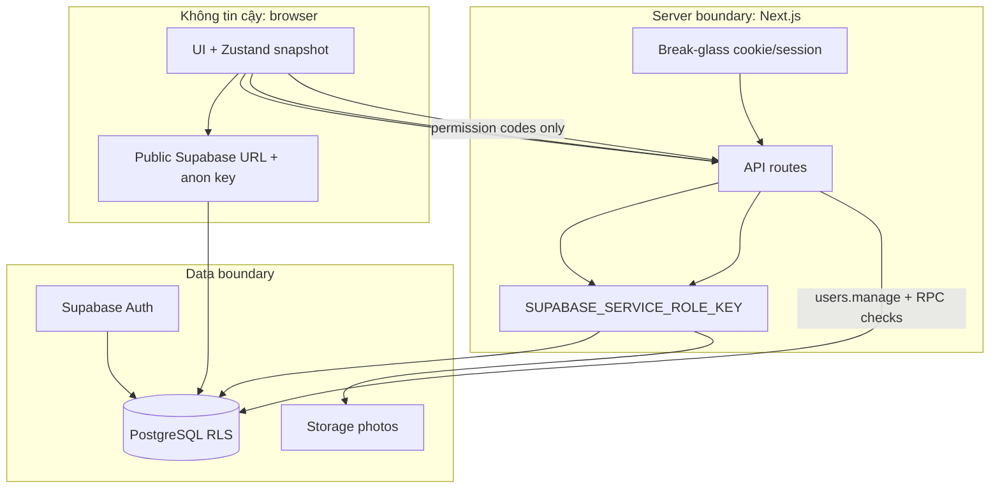
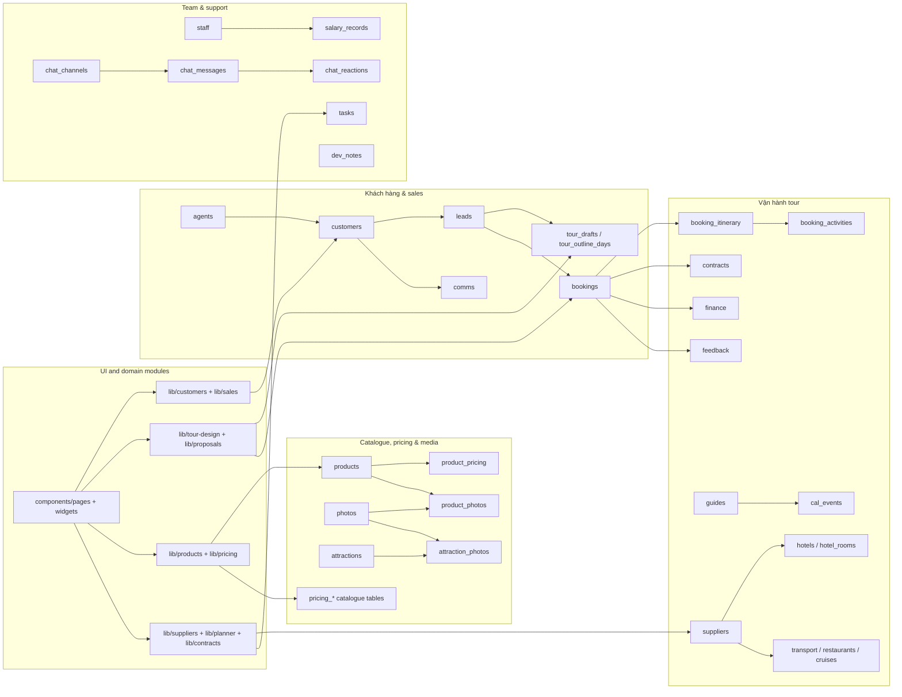
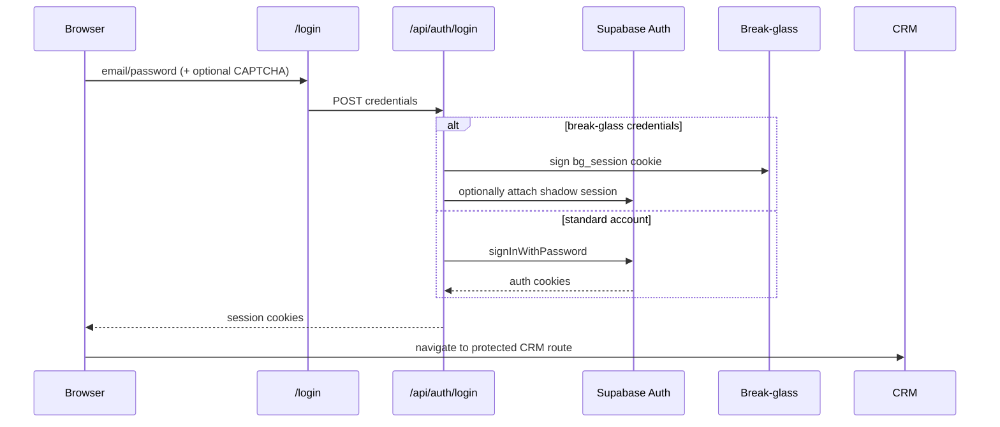
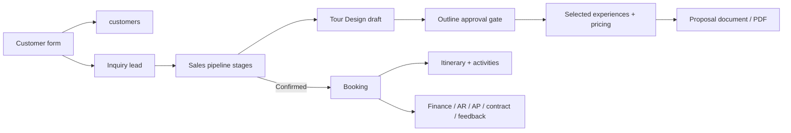
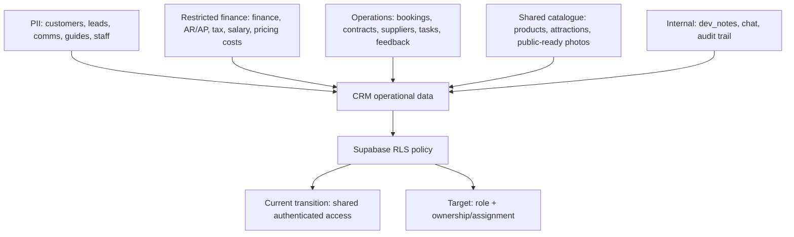
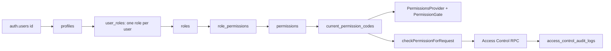

# GraphRAG Memory — The Ant Adventures CRM

> Snapshot: 2026-08-02 · phạm vi: mã nguồn đang có trong repository, không bao gồm `node_modules` hay `.next`. Bao gồm module Access Control đã commit ở `0345007`.
>
> Mục đích: đây là memory map để truy vết nhanh **chức năng → file → dữ liệu → luồng chạy**. Các sơ đồ là các cạnh có hướng; tên trong dấu backtick là node có thể tìm bằng `rg`.

## 1. Retrieval index

| Muốn tìm | Bắt đầu từ | Theo cạnh tới |
|---|---|---|
| Điều hướng/trang CRM | `lib/constants.ts` (`NAV_SECTIONS`, `VALID_PAGES`) | `app/(crm)/[page]/page.tsx` → `components/pages/index.ts` → page component |
| Dữ liệu CRM | `lib/store.ts`, `lib/types.ts` | `components/StoreProvider.tsx` → `lib/db/hydrate.ts` / `lib/db/sync-push.ts` → `lib/db/supabase.ts` |
| Supabase/schema & RLS | `supabase/schema.sql`, `supabase/migrations/20260730042242_02_migrations.sql`, `docs/DATABASE.md` | table → mapper trong `lib/db/mappers.ts` → `lib/db/supabase.ts`; RLS chuyển tiếp ở `supabase/rls-authenticated.sql` |
| Đăng nhập/session | `app/api/auth/login/route.ts` | `lib/auth/*`, `lib/env.ts`, `middleware.ts` |
| Quyền và Access Control | `lib/auth/permissions.ts` | `PermissionsProvider` → `/api/auth/permissions` → `current_permission_codes()`; `/access-control` → `components/access-control/*` → `/api/access-control/*` → RPC Supabase |
| Sales đến booking | `components/pages/Sales.tsx` | `lib/customers/*`, `lib/sales/*`, `components/pages/Bookings.tsx` |
| Thiết kế tour/proposal | `components/pages/TourDesign.tsx` | `components/tour-design/*` → `lib/tour-design/*` / `lib/proposals/*` |
| Bảng giá/XLSX | `components/pages/Pricing*.tsx` | `components/pricing/*` → `lib/pricing/*` → bảng `pricing_*` |
| Ảnh | `components/pages/Gallery.tsx` | `components/gallery/*` → `lib/gallery/*` / `lib/storage/*` → Storage `photos` |
| API server | `app/api/**/route.ts` | `lib/auth`, `lib/weather`, `lib/storage`, `lib/system`, `lib/proposals` |
| Kiểm thử | `tests/*.test.ts` | module `lib/` cùng tên; test runner là `npm test` (hai test XLSX cần workbook gitignored trong `Personal/Material/pricing/`) |

## 2. System graph

```mermaid
flowchart LR
  U[Nhân viên / Browser] --> N[Next.js 14 App Router]
  N --> L[Root layout]
  L --> R[/(crm)/[page] dynamic route]
  R --> C[CRM client shell]
  C --> P[components/pages]
  C --> Z[Zustand: lib/store.ts]
  P --> Z
  C --> S[StoreProvider + AutoSyncListener]
  S --> H[Hydrate: lib/db/hydrate.ts]
  H --> HL[Hydration lifecycle + baseline counts]
  S --> A[Auto-sync: lib/db/auto-sync.ts]
  HL --> A
  H --> D[lib/db/supabase.ts]
  A --> D
  D --> SB[(Supabase PostgreSQL + Storage)]
  N --> API[app/api/* route handlers]
  API --> SB
  API --> EXT[Open-Meteo / Puppeteer PDF / Sentry]
  P --> AC[Access Control UI]
  AC --> API
  API --> ARBAC[Access Control RPC]
  ARBAC --> SB
  U --> LOGIN[/login]
  LOGIN --> AUTH[/api/auth/login]
  AUTH --> SA[Supabase Auth + break-glass]
```

### Trust boundaries



## 3. Route and UI graph

```mermaid
flowchart TB
  ROOT[/] --> DASH[/dashboard]
  CRM[app/(crm)/layout.tsx] --> SHELL[Sidebar + Topbar + StoreProvider + AI Copilot]
  DYN[app/(crm)/[page]/page.tsx] --> REG[PAGE_COMPONENTS]

  REG --> S1[Sales & Product]
  S1 --> dashboard
  S1 --> planner
  S1 --> customers
  S1 --> agents
  S1 --> sales
  S1 --> tourdesign
  S1 --> products
  S1 --> gallery
  S1 --> pricing
  S1 --> pricing_essentials[pricing-essentials]
  S1 --> pricing_accommodation[pricing-accommodation]
  S1 --> weather
  S1 --> attractions

  REG --> S2[Operations]
  S2 --> bookings
  S2 --> contracts
  S2 --> suppliers
  S2 --> guides
  S2 --> posttour

  REG --> S3[Finance]
  S3 --> finance
  S3 --> tax
  S3 --> salary

  REG --> S4[Company Portal]
  S4 --> about
  S4 --> culture
  S4 --> regulations
  S4 --> hr
  S4 --> ai
  S4 --> devnotes
  S4 --> teamchat

  REG --> S5[System]
  S5 --> accesscontrol[access-control]
```

Page registry: `components/pages/index.ts` lazy-loads every page except `Dashboard`. `lib/constants.ts` is the authoritative navigation and slug registry; `lib/types.ts` supplies `PageSlug`.

## 4. Domain graph



### Domain node catalogue

| Area | UI nodes | Logic/data nodes | Primary persistence |
|---|---|---|---|
| CRM shell | `Sidebar`, `Topbar`, `StoreProvider`, `AutoSyncListener` | `store.ts`, `constants.ts`, `types.ts`, `context/` | all synchronised tables |
| Customers & B2B | `pages/Customers`, `pages/Agents`, `components/customers`, `components/agents` | `customers/`, `sales/agents-commission.ts` | `customers`, `agents`, `comms`, `leads` |
| Sales | `pages/Sales` | `sales/sales-lead-utils.ts`, `sales/booking-from-lead.ts` | `leads`, `bookings` |
| Tour Design | `pages/TourDesign`, `components/tour-design/*` | `tour-design/*`, `proposals/*` | `tour_drafts`, `tour_outline_days`, products/pricing |
| Product & Gallery | `pages/Products`, `pages/Gallery`, `components/products`, `components/gallery` | `products/*`, `gallery/*`, `storage/*` | `products`, `product_pricing`, `photos`, Storage |
| Pricing | `pages/Pricing*`, `components/pricing/*` | `pricing/*` | `pricing_*` tables; selected legacy product prices |
| Operations | `pages/Bookings`, `Contracts`, `Suppliers`, `Guides`, `PostTour`, `Planner` | `contracts/`, `suppliers/`, `planner/` | booking, supplier, guide, contract, feedback, task tables |
| Finance & HR | `pages/Finance`, `Tax`, `Salary`, `HR` | shared store/mappers | finance, AR/AP, tax, staff, salary tables |
| Information | `About`, `Culture`, `Regulations`, `AI`, `DevNotes`, `TeamChat`, `Weather`, `Attractions` | `weather/*`, `attractions/*`, `system/*`, `i18n/*` | notes/chat/weather cache/attractions |

## 5. Execution-flow graph

### Login and session



Implemented session bridge: `middleware.ts` calls `updateSession` from `lib/supabase/middleware.ts`; `lib/supabase/index.ts` caches the browser client created by `lib/supabase/client.ts`. Middleware keeps `/api/health`, login/logout and configured debug paths public, refreshes Supabase cookies, and redirects unauthenticated CRM traffic to `/login`. Break-glass sessions can also attach a shadow Supabase session for authenticated RLS access.

### Permission load and Access Control

```mermaid
sequenceDiagram
  participant B as Browser
  participant PP as PermissionsProvider
  participant PA as /api/auth/permissions
  participant RPC as current_permission_codes()
  participant AC as /access-control + API
  participant DB as Access Control RPC

  B->>PP: CRM mount after login
  PP->>PA: GET permission codes once
  PA->>RPC: use current session cookie
  RPC-->>PP: permission codes, e.g. users.manage or *
  PP->>AC: PermissionGate checks PAGE_READ_PERMISSION
  alt Has users.manage or *
    AC->>DB: manage users/roles/audit through protected API
  else Missing permission
    AC-->>B: do not mount page; link back to Dashboard
  end
```

`PermissionsProvider` caches permission codes in React Context for the current CRM session; `hasPermission()` accepts either the requested code or the Super Admin wildcard `*`. This cache improves UI responsiveness only. Every Access Control API and its database RPC perform their own `users.manage` check.

### Hydrate and synchronization


Important implementation nodes:

- `lib/db/sync-config.ts` maps 28 table names to `BackupData`/Zustand keys, declares `PAGE_BOOT_TABLES` (per-route boot), `SIDEBAR_IDLE_TABLES`, `PROFILE_LAZY_TABLES`, and FK-safe write waves.
- `lib/db/route-cache.ts` — sessionStorage route snapshot (5 min TTL); background revalidate only after 60s or on tab visible.
- `lib/db/mappers.ts` transforms domain models ↔ SQL rows.- `lib/db/sync-lifecycle.ts` tracks `hydratedTables` / messages; blocks automatic writes until boot ready; auto-sync must not push unhydrated tables.
- `lib/db/sync-policy.ts` makes `products` and `product_pricing` upsert-only. Other synchronized tables skip orphan deletion when the local row count is below 90% of the hydrated baseline; `force` can bypass that guard for mirror tables.
- `lib/db/supabase.ts` reads nested associations via PostgREST embeds (one request per parent table) and can delete remote IDs absent from a local snapshot when the guard permits it. Nested booking, hotel, product and attraction associations are replaced per parent during sync.
- `components/PageDataGate.tsx` boots route tables; `CustomerProfileModal` lazy-loads `comms` + `bookings`.

### Sales to proposal to booking



### Photo and weather server paths

```mermaid
flowchart LR
  G[Gallery UI] --> Init[/api/photos/upload/init]
  Init --> Chunk[/api/photos/upload/chunk]
  Chunk --> Complete[/api/photos/upload/complete]
  Complete --> Pipe[lib/image-pipeline + upload-gallery-photo-server]
  G --> PD[/api/photos/delete]
  PD --> Pipe
  Pipe --> ST[Supabase Storage photos bucket]
  Pipe --> PT[photos + photo_tags]

  W[Weather UI] --> WR[/api/weather/refresh]
  WR --> WA[lib/weather/auth]
  WA --> OF[Open-Meteo]
  OF --> WC[weather_* cache tables]
  W --> WW[/api/weather/weekly]
  WW --> WC
```

## 6. API graph and guards in the current source

| Route | Consumer / purpose | Current guard | Dependency |
|---|---|---|---|
| `POST /api/auth/login` | login form | rate limit; public by design | Supabase Auth / break-glass |
| `POST /api/auth/logout` | Topbar | no explicit route check | Supabase Auth |
| `GET,POST /api/auth/users` | recovery/admin use | `requireBreakGlass` | service-role Auth admin |
| `GET /api/health` | external monitor | public by design | Supabase Auth health |
| `POST /api/photos/upload/init`, `/chunk`, `/complete`, `/delete` | gallery (chunked → Sharp → Storage) | authenticated only | Storage + `photos` tables |
| `POST /api/pricing/export`, `/api/proposals/export` | pricing/tour-design | authenticated only; no role/permission export check | Puppeteer/Chromium PDF |
| `GET,PUT /api/system/*` | debug panel | debug token except debug-log POST | diagnostics/log buffer |
| `POST /api/weather/refresh` | weather page or cron | authenticated user or cron secret | service-role cache + Open-Meteo |
| `GET /api/weather/weekly` | weather page | no explicit guard | service-role cache |
| `GET,PATCH /api/access-control` | role and permission tab | `users.manage` at API and RPC | `lib/access-control/server.ts` + authorization RPC |
| `GET,POST,PATCH,DELETE /api/access-control/users` | user directory | `users.manage` at API and RPC; create additionally uses server-only Admin API | Auth, `profiles`, `user_roles`, audit RPC |
| `GET /api/access-control/audit-logs` | audit log tab | `users.manage` at API and RPC | paginated audit-log RPC |

## 7. Data graph and sensitivity groups



Schema relationships live in `docs/DATABASE.md` and `supabase/schema.sql`; the CLI baseline is `supabase/migrations/20260730042242_02_migrations.sql`. Fresh schema/migration sources still create `dev_allow_all` policies. The tracked `supabase/rls-authenticated.sql` is a manual transition run after Auth login works: it replaces those policies with shared `authenticated_access` policies. It blocks anonymous direct access but does **not** implement the role/ownership model below; whether it has been applied to a remote project must be checked separately.

## 8. RBAC implementation — delivered 2026-08-02

### Current role model

RBAC now uses roles as a convenient business grouping and permission codes as the enforcement primitive. A role is not checked by page/API code directly, except where the management UI must constrain valid role names.

| Role | Effective permission model | Access Control capability |
|---|---|---|
| `super_admin` | wildcard `*` | Can open `/access-control` and manage users, roles, permissions and audit logs. The wildcard is view-only in the role UI. |
| `admin` | permissions assigned through `role_permissions` | Can use the CRM functions granted to the role; cannot receive `users.manage` through the UI/RPC. |
| `employee` | permissions assigned through `role_permissions` | Can use the CRM functions granted to the role; cannot receive `users.manage` through the UI/RPC. |

`users.manage` is the sole permission required for Access Control. The migration removes it from `admin`/`employee`, hides it from the editable permission list, and rejects attempts to add `users.manage` or `*` to either role.

### Permission data and enforcement graph



The same permission is checked in three places:

1. **UI:** `PermissionsProvider` loads only permission codes and `PermissionGate` prevents the `/access-control` page from mounting for users without `users.manage`.
2. **Next.js API:** every `/api/access-control/*` route calls `checkPermissionForRequest('users.manage')`; a direct browser request cannot bypass this.
3. **Database RPC:** each sensitive RPC calls `public.has_permission('users.manage')`; this protects against an API mistake or a direct RPC request.

The first layer is for navigation and user experience. The API and database layers are the actual authorization boundaries.

### Access Control UI and APIs

| Feature | Main UI node | Route | Server/database operation |
|---|---|---|---|
| View users, search, role/status filters and summary | `UserDirectory.tsx` | `GET /api/access-control/users` | `list_access_control_users_page`, `get_access_control_user_summary` |
| Create user | `UserCreateDrawer.tsx` | `POST /api/access-control/users` | Create `auth.users` with service role; trigger creates profile; RPC sets profile and role; rollback Auth user on partial failure |
| Change a user role | `UserAccessDrawer.tsx` | `PATCH /api/access-control` | `set_user_role` |
| Edit display name | `UserEditDrawer.tsx` | `PATCH /api/access-control/users` | `update_access_control_user_profile` |
| Activate/deactivate or soft-delete a user | `UserActionsMenu.tsx` | `PATCH`/`DELETE /api/access-control/users` | lifecycle RPCs; rejected for self-targeting and the last Super Admin |
| Configure Admin/Employee permissions | `RolesPermissionsTab.tsx` | `PATCH /api/access-control` | `replace_role_permissions` |
| Read change history | `AuditLogsTab.tsx` | `GET /api/access-control/audit-logs` | `list_access_control_audit_logs` |

The browser accesses these routes through `components/access-control/access-control-api.ts`; it does not call Supabase directly for management operations. `lib/access-control/server.ts` makes RPC calls with the current user's cookies, so PostgreSQL sees the correct `auth.uid()`. The only service-role module is `lib/auth/access-control-admin.ts`, used solely to create/rollback an Auth user on the server.

### Versioned migrations for the delivered module

| Migration | Responsibility |
|---|---|
| `20260802010226_add_super_admin_role.sql` | Seeds `super_admin`, assigns wildcard `*`, removes `users.manage` from Admin. |
| `20260802014552_add_access_control_rpcs.sql` | Adds audit table, role/permission/user management RPC baseline and one-role-per-user constraint. |
| `20260802070833_protect_access_control_system_permissions.sql` | Protects `users.manage` and prevents wildcard/system permission assignment to Admin/Employee. |
| `20260802123339_add_access_control_user_pagination.sql` | Adds server-side user listing, filters and role statistics. |
| `20260802131905_add_access_control_audit_list.sql` | Adds protected, paginated audit-log read RPC. |
| `20260802141248_add_access_control_user_lifecycle.sql` | Adds soft-delete state and excludes deleted users from permission codes, normal listings and statistics. |
| `20260802142349_add_access_control_user_write_rpcs.sql` | Adds update profile, activate/deactivate, soft-delete/restore RPCs and lifecycle audit actions. |

`supabase/snippets/gan_quyen_super_admin.sql` is a controlled manual bootstrap snippet to assign the first Super Admin after its Auth/profile records exist. It must not be used as an application runtime path.

### Audit trail

The `access_control_audit_logs` table records the actor, target, before/after values and time. The current UI maps these actions to Vietnamese labels: `user_role_changed`, `role_permissions_replaced`, `user_profile_updated`, `user_activated`, `user_deactivated`, `user_soft_deleted`, and `user_restored`. The table is read via the protected RPC rather than directly from the browser.

### Deliberately not yet enforced by this module

- General CRM business tables do **not** yet have role/row-scoped RLS based on these permissions. This work only protects Access Control itself and page-level navigation already wired to permission codes.
- Photo upload/delete, weather refresh, and PDF exports retain their existing guards. PDF exports intentionally require only an authenticated session so both Admin and Employee can export; they are not restricted by a separate export permission.
- The user directory hides soft-deleted users in its normal list. A restore RPC exists, but there is no dedicated deleted-user/restore screen yet.

### Future extension direction

When the business requires more roles, add a role and assign existing permission codes first. Add new permission codes only when a genuinely new action must be distinguished. For record-specific scope, introduce ownership/assignment fields and enforce them with RLS after replacing full-table mirror synchronization with record-level server commands. Candidate future roles include sales, operations, finance, HR, content editor and viewer; they are not currently seeded roles.

## 9. Known integrity and delivery constraints

| Priority | Evidence node | Why it matters to the graph/RBAC plan |
|---|---|---|
| Critical | `supabase/schema.sql:1068-1095` and `supabase/migrations/20260730042242_02_migrations.sql` | Both fresh-install sources grant anonymous `dev_allow_all` access. `rls-authenticated.sql` is tracked but is a manual, shared-access transition, so its remote application must be verified. This is separate from the protected Access Control RPCs. |
| High | `supabase/rls-authenticated.sql`, Access Control migrations | Current RBAC protects permission loading and the Access Control module, not CRUD rows in general CRM business tables. Do not represent the current work as complete data-level RBAC. |
| High | `lib/db/supabase.ts`, `lib/db/sync-policy.ts`, `lib/db/sync-lifecycle.ts` | Snapshot mirror sync still deletes remote rows when the 90% baseline guard permits it or an operator forces a push; this conflicts with concurrent editing and future row-scoped RLS. |
| High | `app/api/photos/delete/route.ts` → `lib/storage/upload-gallery-photo-server.ts` → `lib/storage/photo-paths.ts` | Any authenticated user can invoke a service-role-capable delete and provide an additional `storagePath`; folder policy and validation are not a per-record authorization check. |
| Medium | `components/access-control/UserDirectory.tsx` + lifecycle RPCs | Soft-deleted users are excluded from the normal list; an administrator cannot restore one from the UI until a deleted-user view is added. |
| Medium | `.gitlab-ci.yml` | CI runs lint and production build, but not typecheck or tests. |
| Medium | `tests/pricing-catalog-xlsx.test.ts:8-9` | Two tests depend on XLSX files below gitignored `Personal/Material/pricing/`, so a checkout without local material reports two `ENOENT` failures. |
| Medium | `components/pages/Sales.tsx` (882 lines), `TourDesign.tsx` (778), `Bookings.tsx` (694), `Dashboard.tsx` (690), `lib/db/supabase.ts` (821), `lib/proposals/proposal-assembler.ts` (943) | High coupling makes permission checks and future ownership enforcement expensive; extract command/data boundaries before broad RBAC UI work. |

## 10. Verification status

- Static source review: refreshed for the Access Control routes, UI, server services, migrations and audit test added in commit `0345007`.
- `npx supabase migration list --local`: local and remote histories must match through `20260802142349`; use this command after migration changes rather than `db:status`, which requires a linked hosted Supabase project.
- `npm run typecheck`: passed when Access Control was completed.
- `npm test`: 275 of 277 tests passed in the latest full run. The two failures are `ENOENT` reads for the ignored Essentials and Accommodation XLSX workbooks; no test assertion failed.
- A production build is not claimed for this snapshot: running `next build` concurrently with `next dev` corrupted generated `.next` vendor chunks locally. The cache was moved aside and `next dev` restarted successfully; stop the dev server before the next production-build verification.
- This documentation update changes `docs/GRAPHRAG-MEMORY.md`; no application logic, configuration or database schema was changed by the documentation refresh itself.
